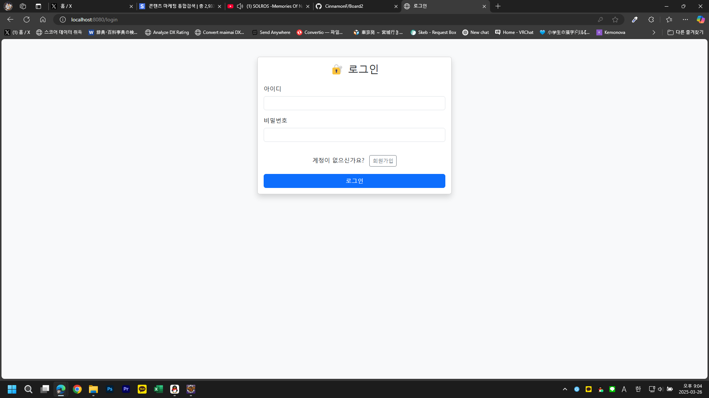
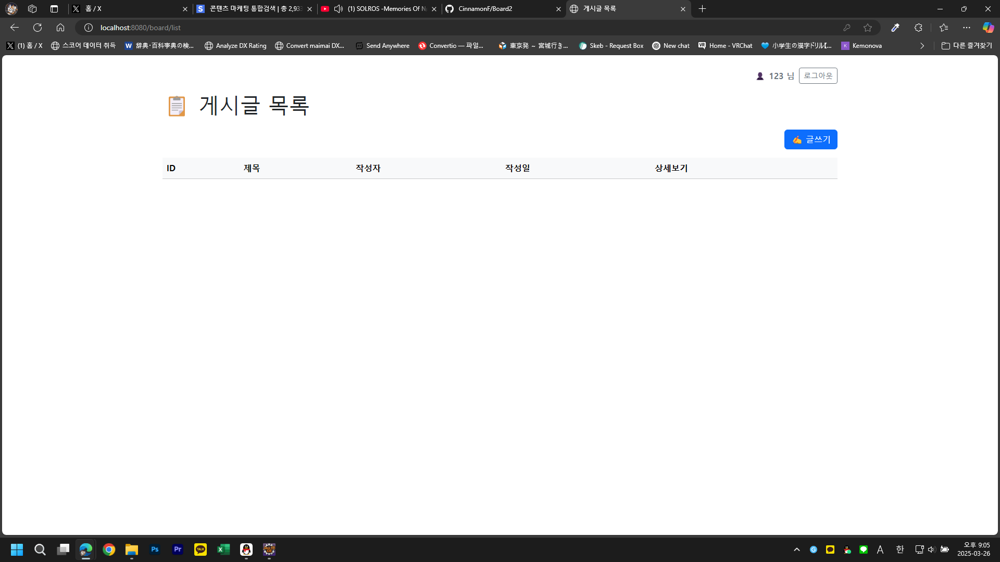
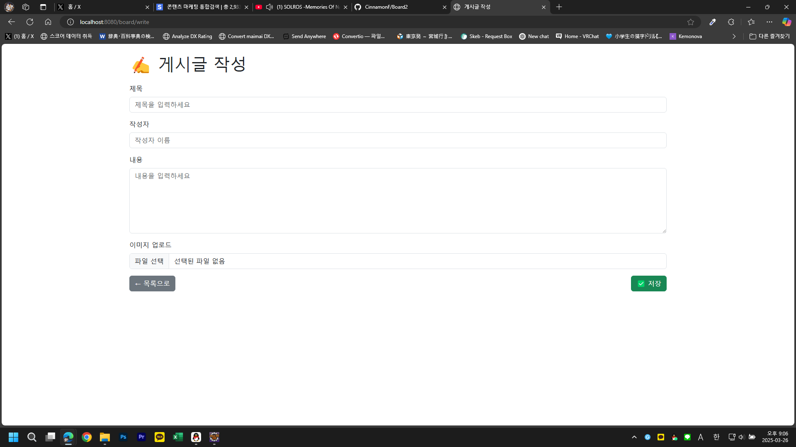

# 📌 Spring Boot 게시판 프로젝트 (Board2)

> 개인 학습 및 포트폴리오용으로 제작한 Spring Boot 기반 웹 게시판입니다.  
> Java, Spring Boot, Spring Security, Thymeleaf를 사용하여 로그인/회원가입/글쓰기/댓글/이미지 업로드 등 다양한 기능을 구현하였습니다.

> Spring Bootを使って個人開発したWeb掲示板アプリケーションです。  
> ログイン、会員登録、投稿、コメント、画像アップロードなどの機能を実装しました。

---

## ✅ 주요 기능 | 主な機能

- 🔐 회원가입 및 로그인 (Spring Security 적용)  
　→ 会員登録・ログイン機能（Spring Security対応）
- 🧾 게시글 CRUD (목록, 상세보기, 작성, 수정, 삭제)  
　→ 投稿の作成、編集、削除、詳細閲覧
- 💬 댓글 기능 (게시글과 연관 관계 설정)  
　→ コメント機能（投稿とのリレーション）
- 🖼 이미지 업로드 (UUID로 저장, static 경로 보관)  
　→ 画像アップロード（UUIDファイル名、静的ディレクトリ保存）
- 👤 로그인 사용자만 글쓰기 가능 (인가 처리)  
　→ 認証ユーザーのみ投稿可能

---

## 🛠 사용 기술 | 技術スタック

- **백엔드**: Java, Spring Boot, Spring Security, Spring Data JPA
- **프론트엔드**: Thymeleaf, HTML, Bootstrap
- **데이터베이스**: H2 (개발용, 메모리 DB)
- **기타**: Multipart 이미지 업로드, BCrypt 암호화

---

## 📁 프로젝트 구조

```
Board2/
├── src/
│   ├── main/
│   │   ├── java/com/example/demo/
│   │   │   ├── controller/
│   │   │   │   ├── BoardController.java
│   │   │   │   └── UserController.java
│   │   │   ├── entity/
│   │   │   │   ├── Board.java
│   │   │   │   ├── Comment.java
│   │   │   │   └── User.java
│   │   │   ├── repository/
│   │   │   │   ├── BoardRepository.java
│   │   │   │   ├── CommentRepository.java
│   │   │   │   └── UserRepository.java
│   │   │   ├── service/
│   │   │   │   └── UserDetailServiceImpl.java
│   │   │   └── config/
│   │   │       └── SecurityConfig.java
│   │   └── resources/
│   │       ├── templates/
│   │       │   └── board/
│   │       │       ├── list.html
│   │       │       ├── write.html
│   │       │       ├── edit.html
│   │       │       ├── view.html
│   │       │       ├── login.html
│   │       │       └── register.html
│   │       └── static/
│   │           └── uploads/ (이미지 저장 경로)
└── README.md
```

---

## ▶ 실행 방법 | 実行方法

1. 프로젝트 클론

```bash
git clone https://github.com/CinnamonF/Board2.git
cd Board2
```

2. IDE에서 실행 (Spring Boot 지원 IDE 추천)

3. 접속 URL  
`http://localhost:8080/board/login`

※ H2 콘솔 주소:  
`http://localhost:8080/h2-console`  
(JDBC URL: `jdbc:h2:mem:testdb`)

---

## 🖼 시연 이미지 (예시)


| 로그인 | 게시판 목록 | 게시글 작성 |
|--------|--------------|--------------|
|  |  |  |


---

## ✨ 만든 사람 | Developer

- GitHub: [CinnamonF](https://github.com/CinnamonF)
- 개발 기간: 2025년 3월
- 기술 스택 학습 기간: 약 6개월 (Java, Spring 중심)

---
